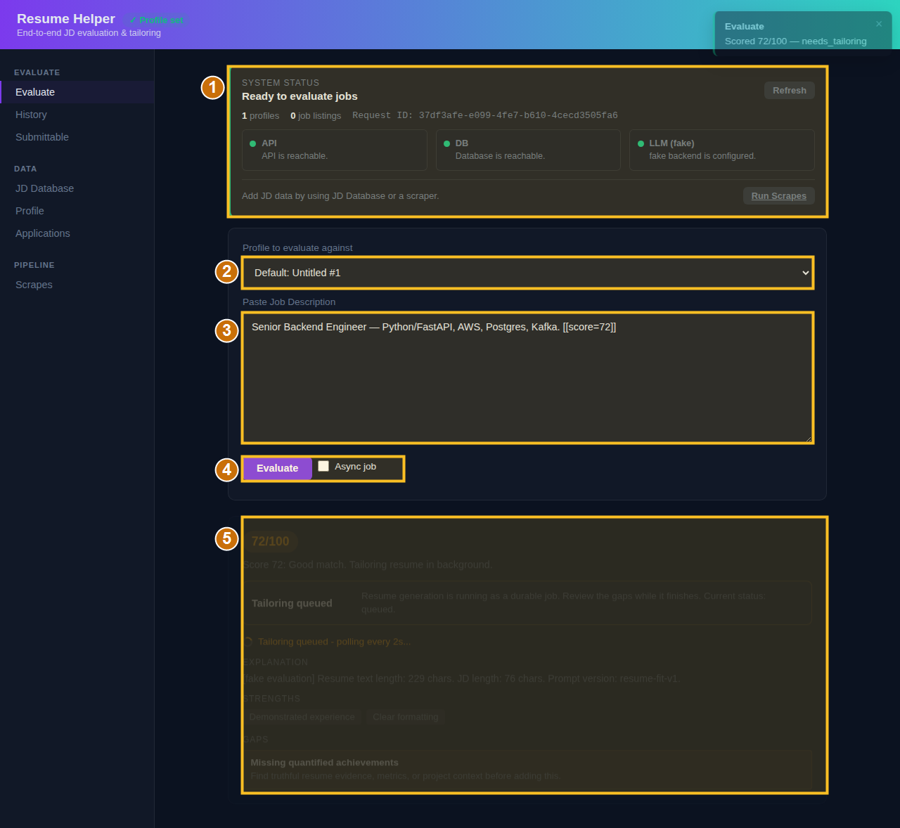
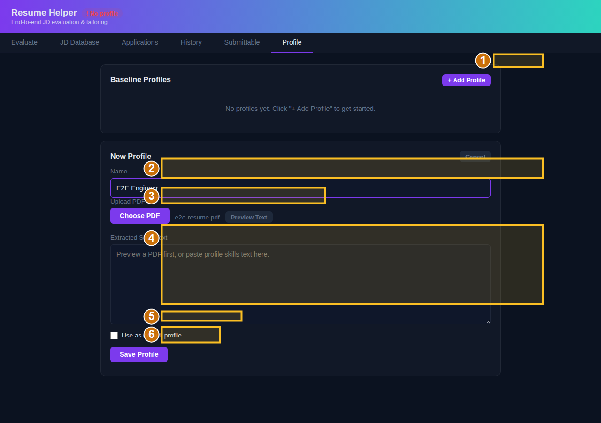
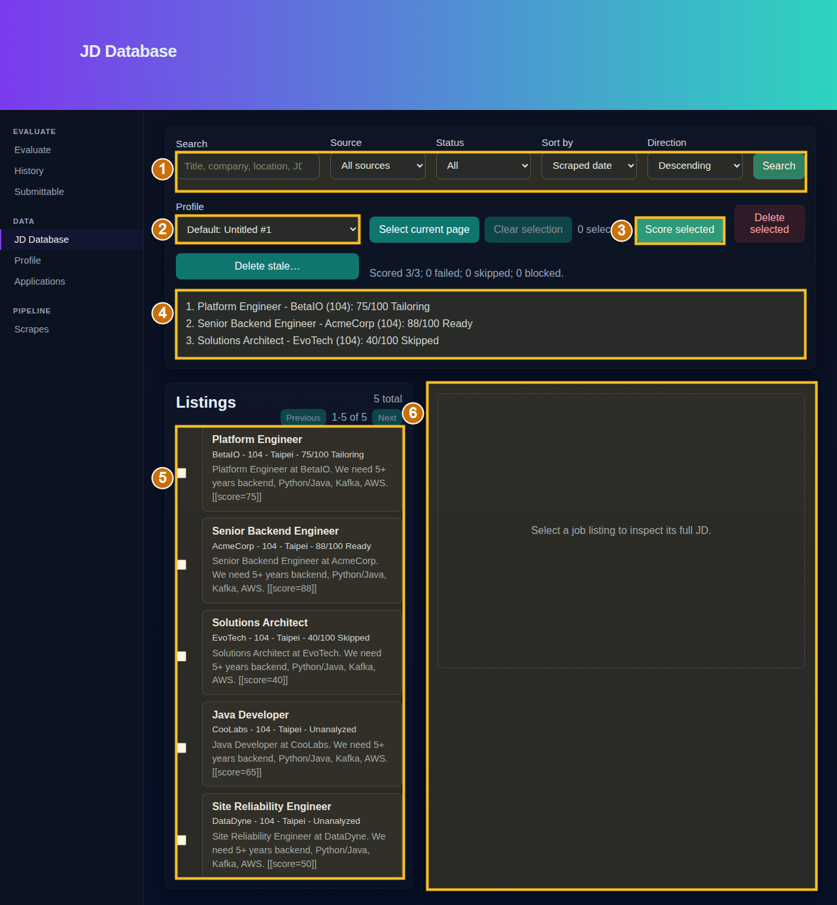
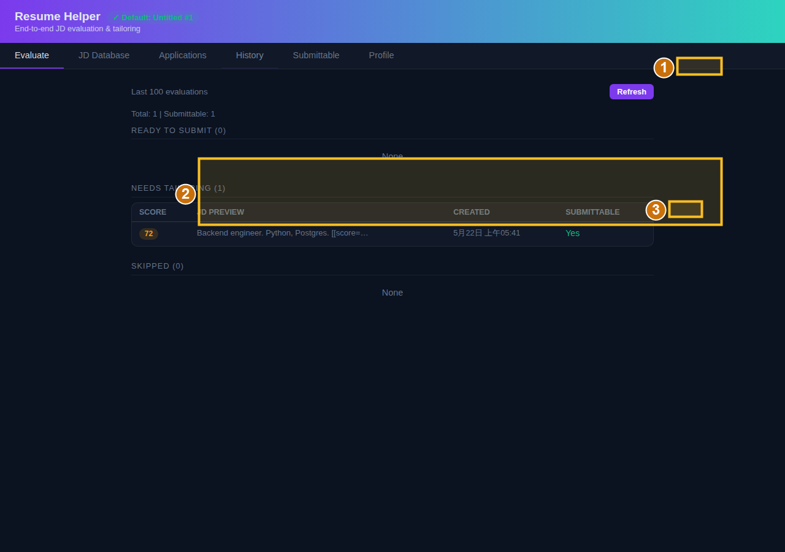
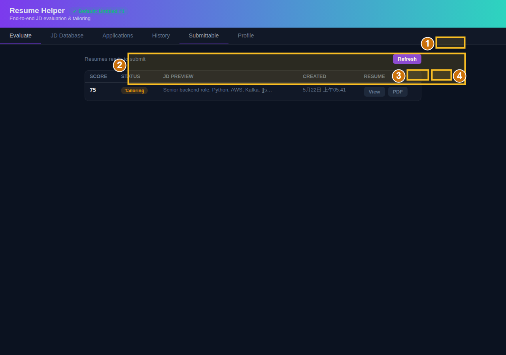
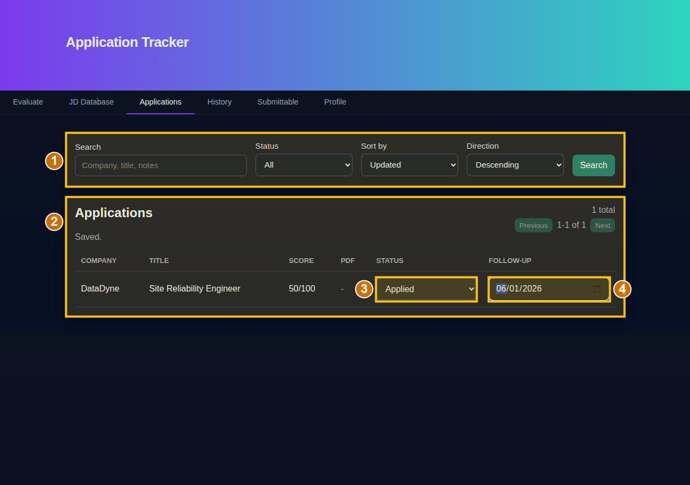

# UI Flow Guide

Tracking issue: https://github.com/jackylailai/resumeHelper/issues/182

This guide first walks through the user workflow step by step, then maps each
screen and button to the backend action it triggers. The annotated screenshots
were copied from the GitHub Actions `e2e-screenshots` artifact generated by the
Playwright E2E workflow.

Source artifact used for this snapshot:

| Field | Value |
|---|---|
| Artifact | `e2e-screenshots` |
| Artifact ID | `7153541674` |
| Created | `2026-05-22T05:41:14Z` |
| Raw local path | `docs/assets/e2e-screenshots/` |
| Annotated local path | `docs/assets/ui-flow/` |

Refresh the raw screenshots with:

```bash
python scripts/download_e2e_screenshots.py
```

If local Git credentials are not available to the script, set `GH_TOKEN` or
`GITHUB_TOKEN` first.

## Start Here

```text
Create Profile
  -> Score a job
  -> Review result
  -> Download resume/PDF when available
  -> Track the opportunity
  -> Follow up from Applications
```

Use this path for a first run through the product.

### Step 1 - Create A Profile

1. Open `http://localhost:8000`.
2. Click **Profile** in the left navigation.
3. Click **+ Add Profile**.
4. Enter a profile name, for example `Backend Engineer`.
5. Either paste skills text directly, or click **Choose PDF** and then
   **Preview Text**.
6. Review the extracted text in **Skills Text**.
7. Check **Use as default profile** if this should be the profile used by
   default.
8. Click **Save Profile**.

Success state: the profile appears in the **Baseline Profiles** list, and the
header shows that a profile is set.

### Step 2 - Score A Pasted JD

1. Click **Evaluate**.
2. In **Profile to evaluate against**, choose the profile you want to use.
3. Paste a job description into **Paste Job Description**.
4. Click **Evaluate**.

Success state: the result panel shows a score, status, explanation, strengths,
and gaps.

Decision points:

| Result | What to do next |
|---|---|
| `ready_to_submit` | Review the result and submit with the current resume |
| `needs_tailoring` | Wait for tailoring, then open **Submittable** |
| `skip` | Use the explanation/gaps to decide whether to ignore the job |

### Step 3 - Score Stored JD Database Listings

Use this path when scraped or imported listings already exist.

1. Click **JD Database**.
2. Use **Search**, **Source**, **Status**, and sort controls to narrow the list.
3. Pick a profile from the **Profile** dropdown.
4. Check one or more listings.
5. Click **Score selected**.
6. Review the batch result list.

Success state: each scored listing shows a score and status. The listing is now
linked to an analysis and can be tracked as an application.

### Step 4 - Review Generated Resume Outputs

1. Click **Submittable**.
2. Click **Refresh** if needed.
3. Click **View** to inspect generated resume text.
4. Click **PDF** to run the readiness checklist and download the PDF.

Success state: the generated resume opens in the modal, or the PDF endpoint
returns a downloadable file.

### Step 5 - Track An Application

1. Click **JD Database**.
2. Select a listing that has already been scored.
3. Click the listing card to open the detail panel.
4. Click **Track Application**.
5. Open **Applications**.

Success state: the opportunity appears in the Applications table with company,
title, score, status, and follow-up fields.

### Step 6 - Update Follow-Up State

1. Open **Applications**.
2. Use the filters if the list is long.
3. Change the row's **Status** dropdown.
4. Set a **Follow-up** date.

Success state: the page shows `Saved.`, and the row keeps the new status/date.

### Step 7 - Look Back At Evaluation History

1. Click **History**.
2. Click **Refresh**.
3. Find the evaluation under `READY TO SUBMIT`, `NEEDS TAILORING`, or
   `SKIPPED`.
4. Click **View** to inspect the full evaluation details.

Use History when you need to audit previous scores or reopen generated resume
details.

## End-to-End Map

The rest of this guide maps the same workflow to annotated screenshots and API
behavior.

## Evaluate



| # | UI element | Trigger | Result |
|---|---|---|---|
| 1 | System Status card | `GET /api/health`; Refresh reruns the same check | Shows API, DB, LLM readiness, profile/listing counts, request ID, and next actions |
| 2 | Profile dropdown | Loaded from `GET /api/profiles` | Selected profile ID is sent with evaluation requests |
| 3 | Paste Job Description textarea | Local input only | JD text becomes `jd_text` in the evaluate request |
| 4 | Evaluate button | `POST /api/evaluate` with `jd_text`, optional `profile_id`, and optional async flag | Scores the JD; duplicate JD/profile combinations return cached results |
| 5 | Result panel | Response from `/api/evaluate`, then optional polling of `GET /api/history/{job_id}` | Shows score, status, explanation, strengths, gaps, and tailoring progress |

Routing rules:

| Score | Status | Product behavior |
|---|---|---|
| `85+` | `ready_to_submit` | The resume can be submitted as-is |
| `60-84` | `needs_tailoring` | Tailoring runs in the background and can later appear in Submittable |
| `<60` | `skip` | The job is retained in history with a skip reason |

## Profile



| # | UI element | Trigger | Result |
|---|---|---|---|
| 1 | `+ Add Profile` | Local UI toggle | Opens the New Profile form |
| 2 | Name field | Local input only | Saved as the profile display name |
| 3 | `Choose PDF` / `Preview Text` | `POST /api/profiles/upload/preview` for preview only | Extracts PDF text without saving a profile |
| 4 | Skills Text textarea | Local input/edit | This text is saved as `skills_text`; reviewed PDF text can be corrected here |
| 5 | `Use as default profile` | Included in create/update request | Makes this profile the default profile used when no explicit profile is selected |
| 6 | `Save Profile` | `POST /api/profiles` for text-only profiles, or `POST /api/profiles/upload` when a PDF file is attached | Creates the profile and refreshes the profile list |

Other Profile actions:

| UI element | Trigger | Result |
|---|---|---|
| `Edit` | Local UI toggle, then `PUT /api/profiles/{id}` on save | Updates name, skills text, and default selection |
| `Make Default` | `PUT /api/profiles/{id}` with `is_default=true` | Clears any previous default and promotes this profile |
| `Delete` | `GET /api/profiles/{id}/delete-impact`, then `DELETE /api/profiles/{id}` after confirmation | Deletes the profile; related history rows remain but lose the profile link |

## JD Database



| # | UI element | Trigger | Result |
|---|---|---|---|
| 1 | Search/filter/sort controls | `GET /api/job-listings` with query parameters | Reloads the listing page with matching stored JDs |
| 2 | Profile dropdown | Loaded from `GET /api/profiles` | Selected profile is used for batch scoring and pasted JD scoring |
| 3 | `Score selected` | `POST /api/evaluate/by-listings` | Scores checked listings and links successful rows to `job_analysis_id` |
| 4 | Batch results panel | Response from `/api/evaluate/by-listings` | Shows per-listing score/status and row-level failures |
| 5 | Listing checkboxes/cards | Local selection state; clicking a card calls `GET /api/job-listings/{id}` | Selects rows for batch scoring or opens the detail panel |
| 6 | Detail panel | `GET /api/job-listings/{id}` | Shows the full JD and exposes follow-up actions when a listing is selected |

Other JD Database actions:

| UI element | Trigger | Result |
|---|---|---|
| `Select current page` | Local selection state | Checks all visible listings |
| `Clear selection` | Local selection state | Clears checked listings |
| `Score pasted JD` | `POST /api/evaluate` | Scores ad hoc JD text without creating a `job_listing` row |
| `Track Application` | `POST /api/applications` | Creates or updates a tracked application for the selected/scored listing |
| `Delete stale...` / `Delete selected` | Listing cleanup endpoint when wired by the page | Removes stale or selected stored listings |

## History



| # | UI element | Trigger | Result |
|---|---|---|---|
| 1 | `Refresh` | `GET /api/history` | Reloads the last evaluation rows |
| 2 | Grouped history table | Response from `/api/history` | Groups rows by `ready_to_submit`, `needs_tailoring`, and `skip` |
| 3 | `View` | `GET /api/history/{job_id}` | Opens the full JD and generated resume details in the resume modal |

## Submittable



| # | UI element | Trigger | Result |
|---|---|---|---|
| 1 | `Refresh` | `GET /api/submittable` | Reloads rows with `can_submit=true` and latest generated resume metadata |
| 2 | Submittable table row | Response from `/api/submittable` | Shows score, status, JD preview, created time, and resume actions |
| 3 | `View` | `GET /api/history/{job_id}` | Opens generated resume text in the modal |
| 4 | `PDF` | `GET /api/generated-resumes/{resume_id}/pdf` after the readiness checklist | Generates or downloads the PDF version of the generated resume |

## Applications



| # | UI element | Trigger | Result |
|---|---|---|---|
| 1 | Search/filter/sort form | `GET /api/applications` with `q`, `status`, `sort_by`, `sort_dir`, `limit`, and `offset` | Reloads the application tracker table |
| 2 | Applications table | Response from `/api/applications` | Shows company, title, score, PDF link, status, and follow-up date |
| 3 | Status dropdown | `PATCH /api/applications/{id}` | Updates status to `planned`, `applied`, `interviewing`, `rejected`, `offer`, or `archived` |
| 4 | Follow-up date input | `PATCH /api/applications/{id}` | Updates `follow_up_date` |

Other Applications actions:

| UI element | Trigger | Result |
|---|---|---|
| PDF link | Opens stored `pdf_url` | Downloads or opens the generated resume PDF for that tracked opportunity |
| Previous / Next | `GET /api/applications` with changed `offset` | Pages through tracked applications |

The screenshot comes from `test_application_tracker_flow.py`, which scores a
JD Database listing, tracks it as an application, opens `/applications.html`,
then updates status and follow-up date.

## Screenshot Maintenance

The workflow that produces screenshots lives in `.github/workflows/e2e.yml`.
It runs `python -m pytest tools/e2e/tests/ -v --tb=short` and uploads
`tools/e2e/screenshots/` as `e2e-screenshots`.

When UI changes, update this guide in three steps:

1. Run or download the latest E2E screenshots.
2. Replace the selected raw images under `docs/assets/ui-flow/`.
3. Regenerate the annotated images and update the callout tables if button
   behavior changed.
