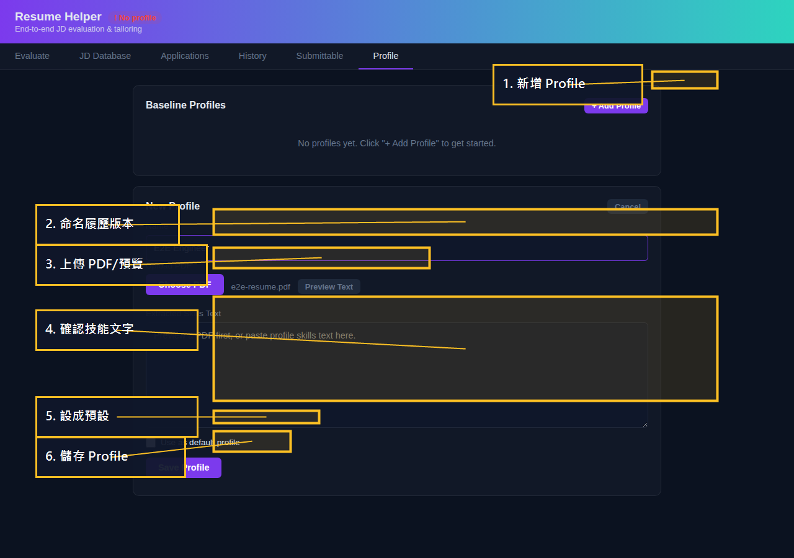
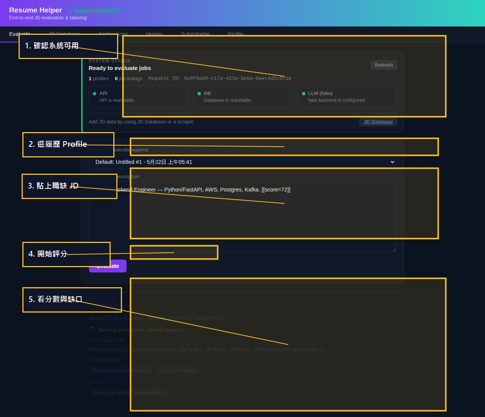
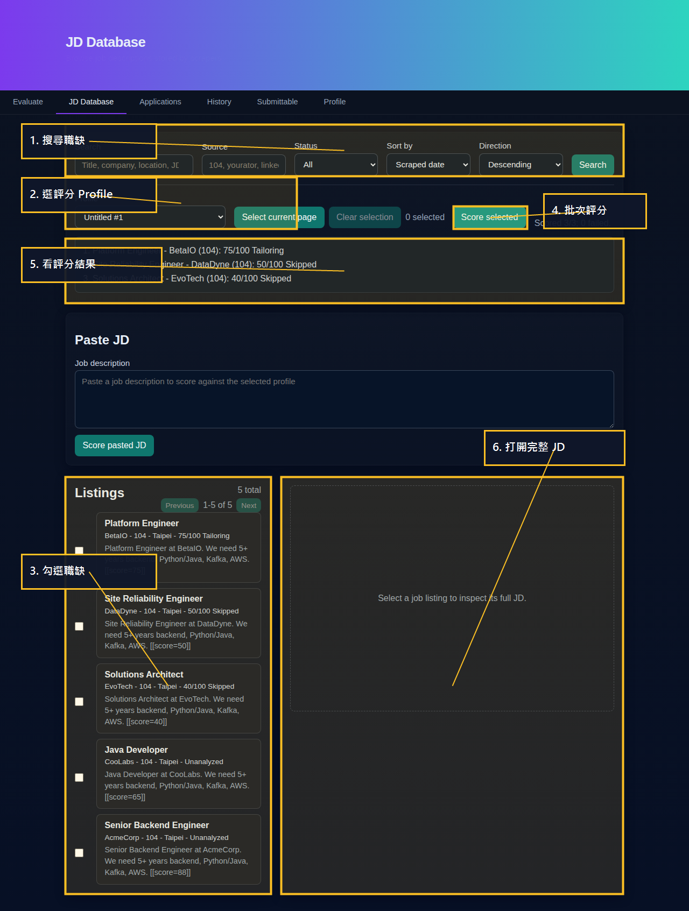
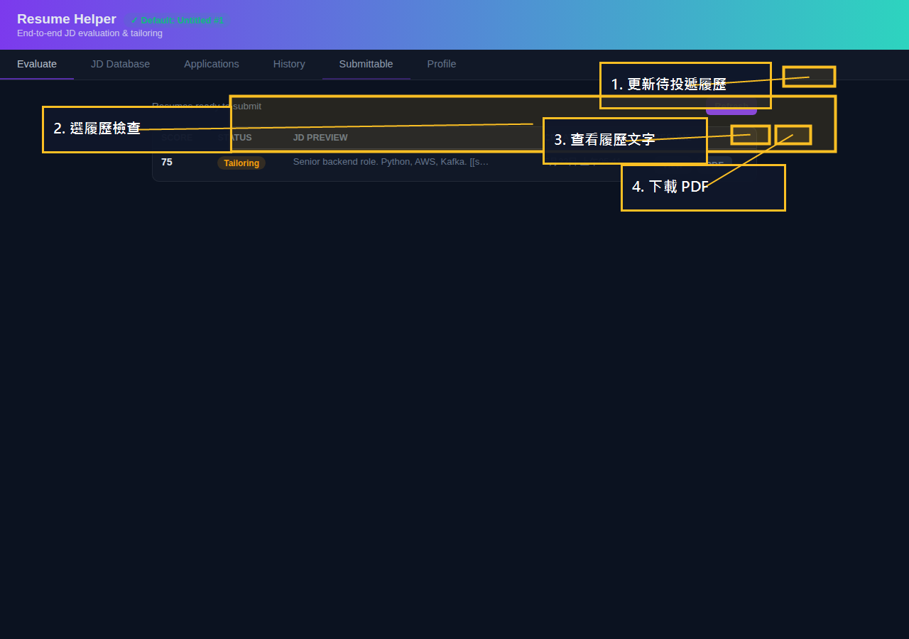
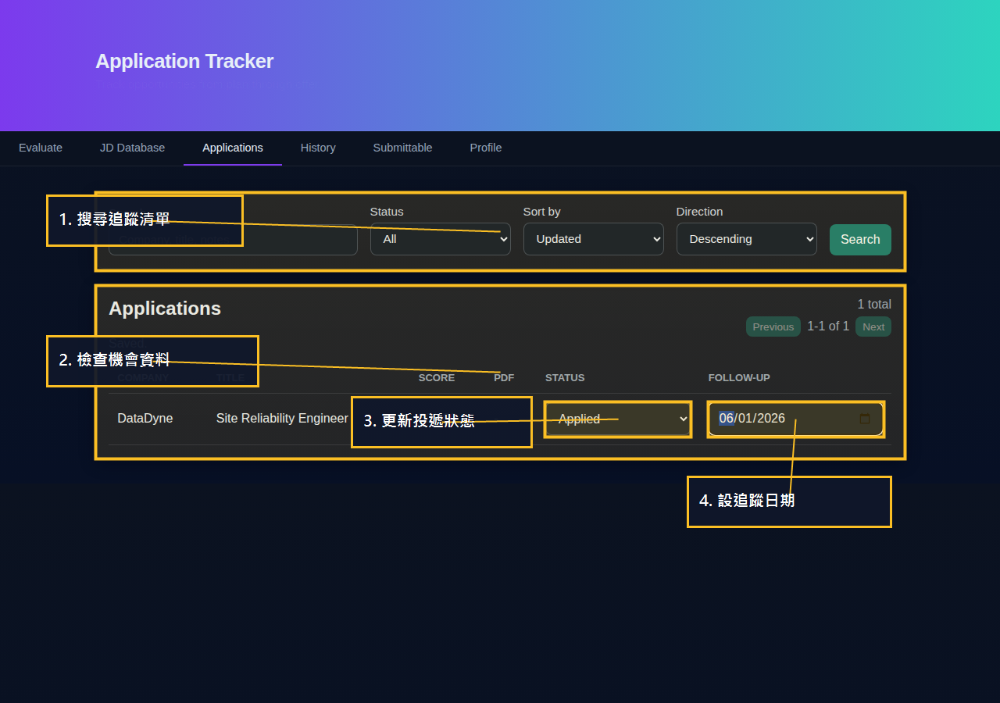
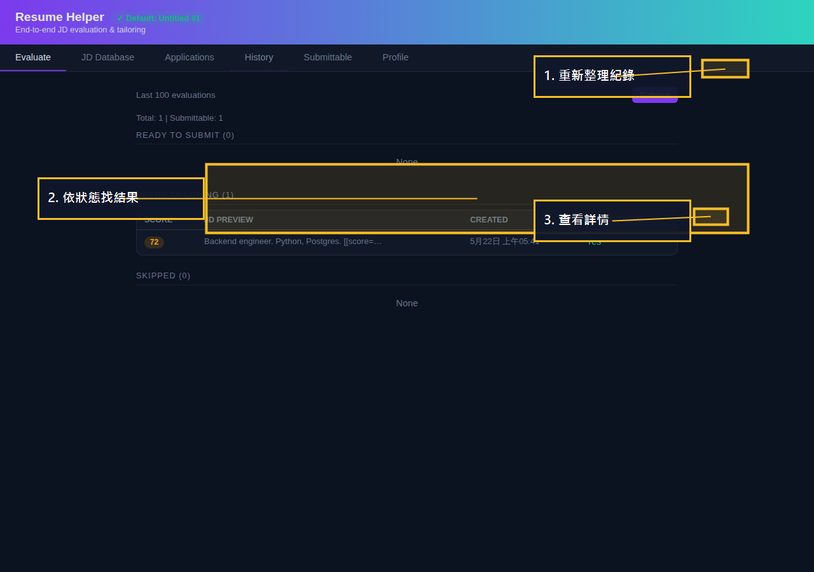

# UI 操作流程導覽

這份文件是給第一次使用 Resume Helper 的人看的。目標是：不用先理解後端 API，也能照著畫面一步一步完成履歷 profile、職缺評分、履歷輸出與投遞追蹤。

英文完整對照版請看 [`ui-flow.md`](ui-flow.md)。

## 頁面總覽

| 頁面 | 代表什麼功能 | 什麼時候使用 | 主要產出 |
|---|---|---|---|
| **Profile** | 履歷基準資料庫 | 第一次設定、切換履歷版本、更新技能文字 | 一個或多個履歷 profile，其中一個是預設 profile |
| **Evaluate** | 單一職缺評分頁 | 從職缺網站、信件或 recruiter 訊息貼上一份 JD | 分數、狀態、優勢、缺口、是否需要產生履歷 |
| **JD Database** | 已儲存職缺工作台 | 已經有爬蟲或匯入的職缺，想搜尋、查看、批次評分 | 已評分的職缺，並連到分析紀錄 |
| **Submittable** | 可投遞履歷檢查區 | 系統已經替某個職缺產生履歷，需要檢查或下載 PDF | 履歷文字預覽與 PDF |
| **Applications** | 投遞追蹤器 | 某個職缺值得投遞，需要記錄狀態與 follow-up 日期 | planned/applied/interviewing/rejected/offer/archived 追蹤列 |
| **History** | 評分紀錄 | 想回查以前的分數、解釋或產生過的履歷 | 依狀態分組的歷史評分 |

## 第一次使用：照這個順序走

```text
建立 Profile
  -> 評分職缺
  -> 查看結果
  -> 需要時下載履歷/PDF
  -> 加入投遞追蹤
  -> 從 Applications 持續追蹤
```

## Step 1 - 建立 Profile



1. 開啟 `http://localhost:8000`。
2. 點 **Profile**。
3. 點 **+ Add Profile**。
4. 輸入 profile 名稱，例如 `Backend Engineer`。
5. 可以直接貼技能文字，也可以點 **Choose PDF** 後再點 **Preview Text**。
6. 檢查 **Skills Text** 裡抽出的文字。
7. 如果這份履歷要作為預設，勾 **Use as default profile**。
8. 點 **Save Profile**。

成功狀態：profile 會出現在 **Baseline Profiles** 清單，頁首也會顯示 profile 已設定。

## Step 2 - 貼上一份 JD 做評分



1. 點 **Evaluate**。
2. 在 profile 下拉選單選要用哪份履歷。
3. 把職缺 JD 貼到文字框。
4. 點 **Evaluate**。
5. 看分數、狀態、優勢與缺口。

結果判斷：

| 狀態 | 接下來做什麼 |
|---|---|
| `ready_to_submit` | 可以用目前履歷投遞，仍建議人工看過一次 |
| `needs_tailoring` | 等系統產生履歷後，到 **Submittable** 檢查 |
| `skip` | 看缺口說明，通常可以略過這個職缺 |

## Step 3 - 從 JD Database 批次評分



1. 點 **JD Database**。
2. 用搜尋、來源、狀態、排序縮小職缺清單。
3. 選要用哪份 profile 評分。
4. 勾選想評分的職缺。
5. 點 **Score selected**。
6. 看批次評分結果。
7. 點某一筆職缺卡片，可以在右側查看完整 JD。

成功狀態：職缺會顯示分數與狀態，也可以加入 Applications 追蹤。

## Step 4 - 檢查可投遞履歷與 PDF



1. 點 **Submittable**。
2. 必要時點 **Refresh**。
3. 點 **View** 查看產生的履歷文字。
4. 點 **PDF** 下載 PDF。

成功狀態：可以在 modal 看到履歷文字，或下載 PDF 檔。

## Step 5 - 加入投遞追蹤

1. 回到 **JD Database**。
2. 選一個已經評分過的職缺。
3. 點職缺卡片打開右側 detail panel。
4. 點 **Track Application**。
5. 打開 **Applications**。

成功狀態：該職缺會出現在 Applications 清單中。

## Step 6 - 更新投遞狀態與追蹤日期



1. 打開 **Applications**。
2. 如果清單很多，可以先用搜尋或狀態篩選。
3. 用 **Status** 下拉選單更新投遞狀態。
4. 在 **Follow-up** 設定下一次追蹤日期。

成功狀態：畫面會顯示 `Saved.`，並保留新的狀態與日期。

## Step 7 - 回查歷史評分



1. 點 **History**。
2. 點 **Refresh**。
3. 依照 `READY TO SUBMIT`、`NEEDS TAILORING`、`SKIPPED` 找結果。
4. 點 **View** 查看完整評分與履歷細節。

History 適合用來回查過去的分數、缺口說明與生成履歷。
